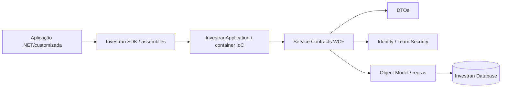
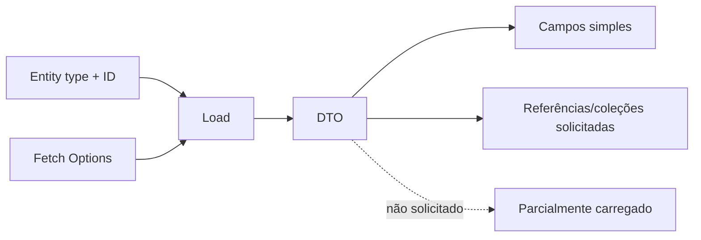

# API e SDK em profundidade

## Relação entre SDK, API e aplicação cliente



O SDK fornece bibliotecas e infraestrutura de cliente. A API expõe contratos de serviço. DTOs transportam dados serializáveis e representam entidades/relacionamentos sem expor diretamente a persistência.

## Operações principais

- **Load:** carrega entidade por tipo/ID e fetch options.
- **Query/LINQ:** consulta conjuntos de DTOs.
- **Publish:** cria ou altera entidades.
- **Remove:** remove entidade conforme regras/permissões.
- **Audit:** obtém histórico e detalhes de auditoria.
- **General Ledger:** trabalha com batch, journal entry, transaction e investor allocation.

## Relacionamentos e fetch options

O modelo possui referências many-to-one e coleções one-to-many/many-to-many. Fetch options controlam quais relações são carregadas. Carregar pouco pode produzir DTO parcialmente carregado; carregar demais aumenta payload, memória e tempo.



## Versionamento e concorrência

O guia indica suporte a versionamento para entidades principais como Legal Entity, Investor e Deal. Integrações devem preservar a versão recebida e tratar conflitos; sobrescrever cegamente um DTO antigo pode perder alteração concorrente.

## Escrita segura

1. Resolver endpoint, identidade e service contract.
2. Carregar referências necessárias.
3. Validar required fields e relações mestre/contextuais.
4. Publicar dentro da unidade transacional apropriada.
5. Guardar IDs, versões, resultado e correlation.
6. Recarregar/reconciliar o objeto.
7. Antes de retry, determinar se a primeira chamada persistiu.

## General Ledger API

Na hierarquia contábil, calls de journal entry, transaction e investor allocation exigem identificadores/índices adicionais para preservar:

```text
Batch ID
  → Journal Entry Index
    → Transaction ID/Index
      → Investor Allocations
```

Isso deve fazer parte dos logs da integração. Sem esses identificadores, investigar escrita parcial ou duplicada se torna muito mais difícil.

## Compatibilidade

Registrar por integração:

- versão do servidor e maintenance release;
- versão dos assemblies SDK;
- endpoint/binding;
- service contracts e DTOs usados;
- autenticação/certificado;
- timeout e retry;
- consumidor e owner;
- testes de compatibilidade para upgrade.

## Fontes

- *INV_API_Training_Guide_7.pdf*, Object Model, DTOs, WCF, Load/Query/Publish/Remove, versioning e General Ledger.
- *Internal_Inv7_INV_SDK_Datasheet_7.pdf*.
- *Internal_Inv7_INV_SDK_Implementation_7.pdf*.
