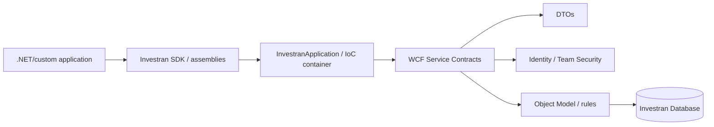
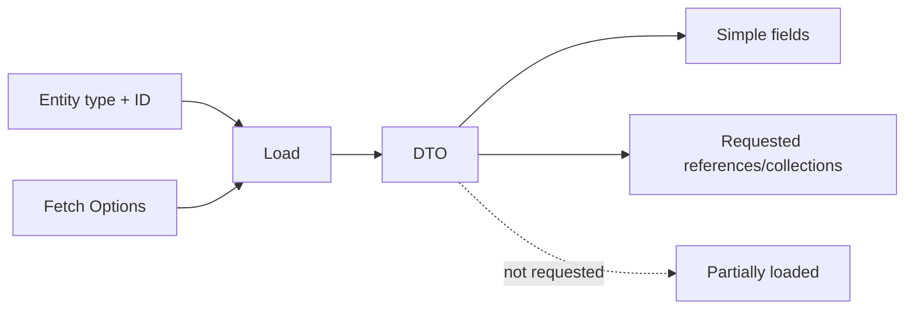

# API and SDK in depth

## Relationship between SDK, API, and client application



The SDK provides client libraries and infrastructure. The API exposes service contracts. DTOs carry serializable data and represent entities/relationships without exposing persistence directly.

## Main operations

- **Load:** Loads an entity by type/ID and fetch options.
- **Query/LINQ:** Queries DTO sets.
- **Publish:** Creates or changes entities.
- **Remove:** Removes an entity according to rules/permissions.
- **Audit:** Retrieves audit history and details.
- **General Ledger:** Works with batch, journal entry, transaction, and investor allocation.

## Relationships and fetch options

The model has many-to-one references and one-to-many/many-to-many collections. Fetch options control which relationships are loaded. Loading too little can produce a partially loaded DTO; loading too much increases payload, memory, and time.



## Versioning and concurrency

The guide indicates versioning support for main entities such as Legal Entity, Investor, and Deal. Integrations must preserve the received version and handle conflicts; blindly overwriting an old DTO can lose a concurrent change.

## Safe writes

1. Resolve endpoint, identity, and service contract.
2. Load required references.
3. Validate required fields and master/contextual relationships.
4. Publish inside the appropriate transaction unit.
5. Store IDs, versions, result, and correlation.
6. Reload/reconcile the object.
7. Before retrying, determine whether the first call persisted.

## General Ledger API

In the accounting hierarchy, journal entry, transaction, and investor allocation calls need extra identifiers/indexes to preserve:

```text
Batch ID
  → Journal Entry Index
    → Transaction ID/Index
      → Investor Allocations
```

Include this data in integration logs. Without it, investigating a partial or duplicated write becomes much harder.

## Compatibility

Record for every integration:

- Server version and maintenance release.
- SDK assembly version.
- Endpoint/binding.
- Service contracts and DTOs in use.
- Authentication/certificate.
- Timeout and retry behavior.
- Consumer and owner.
- Upgrade compatibility tests.

## Sources

- *INV_API_Training_Guide_7.pdf*, Object Model, DTOs, WCF, Load/Query/Publish/Remove, versioning, and General Ledger.
- *Internal_Inv7_INV_SDK_Datasheet_7.pdf*.
- *Internal_Inv7_INV_SDK_Implementation_7.pdf*.
