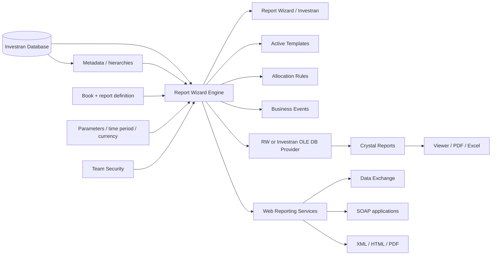
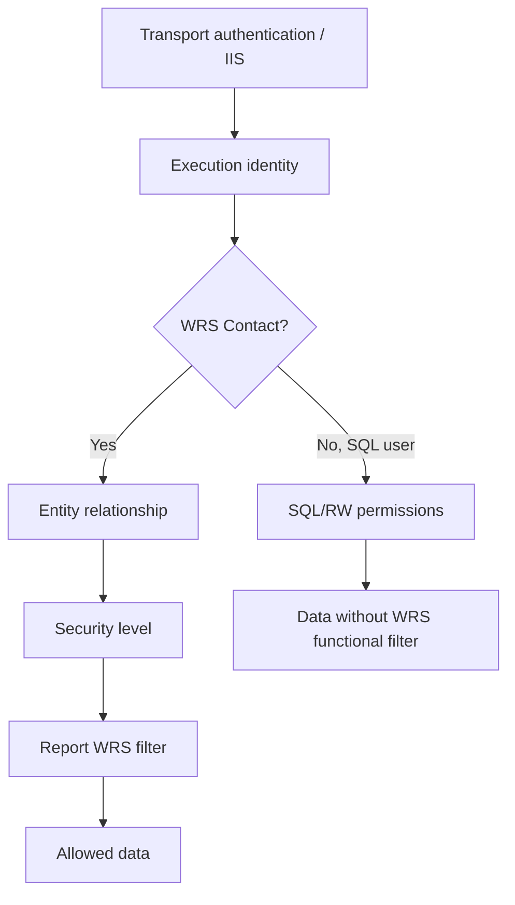

# Reporting architecture

## Component map

## Execution paths

| Path | Sequence | Relevant identity/security |
|---|---|---|
| Interactive | User → Investran → RW engine → database | Investran login and Team Security |
| Direct Crystal | User → RW → Crystal Viewer | Report access and installed provider |
| External Crystal | Crystal → OLE DB Provider → RW engine → database | Connection account, RW User/Admin, and parameters |
| WRS with Contact | Consumer → IIS/WRS → RW engine → database | Contact, relationship, security level, and WRS filter |
| WRS with SQL user | Consumer → IIS/WRS → RW engine → database | SQL user; manual warns that WRS filters/security levels are not applied |
| Automation | AT/AR/BE → report driver → RW engine | Process account and driver-report contract |

## Why an RW report is a shared component

A report can be a human interface, Crystal source, Active Template driver, Allocation Rule source, Business Event dependency, or integration contract at the same time. Changing columns, filters, names, types, or cardinality can affect processes that do not appear related to its screen.

## Security boundaries

IIS authentication does not prove functional authorization in the report. Likewise, running with an administrative or SQL account can hide configuration errors and create a false validation.

## Diagnosis by layer

| Layer | Typical symptom | Required evidence |
|---|---|---|
| Consumer | Invalid call, pagination, or PDF | Sanitized request, method, format, response/fault |
| Network/TLS | WRS unavailable | DNS, port, certificate, firewall, handshake |
| IIS/WRS | 5xx, recycle, or general failure | IIS/application logs, app pool, CPU, memory |
| WRS configuration | Company/connection not found | `CompanyID`, mapping, connection test |
| Security | Missing, empty, or excessive report | Contact, relationship, security level, filter, identity |
| Parameters | Empty result or type error | ID, name, type, format, actual value |
| RW definition | Incorrect total/cardinality | Version, columns, filters, aggregation, hierarchy |
| Engine/SQL | Slow or timeout | Isolated RW duration, volume, plan, blocking |
| OLE DB/Crystal | RW works, layout fails | Provider, Add Command, datasource, schema, subreports |
| Automation | Interactive works, job fails | Process account, published version, context |

## Isolation order

1. Confirm environment, user, and execution path.
2. Run the base RW report with the same parameters.
3. Compare with a known data set and last good version.
4. Add one layer at a time: provider, Crystal, WRS, or automation.
5. Validate security with a representative user and a negative test.
6. Only then investigate database tuning or timeout increases.

## Related guides

- [Report Wizard - development and operations](02-report-wizard-desenvolvimento-operacao.md)
- [Web Reporting Services](03-web-reporting-services.md)
- [Report Wizard, Crystal Reports, and WRS](../07-report-wizard-e-crystal.md)
- [Runbook - Reporting failure](../../runbooks/falha-reporting.md)

## Sources

- *Internal_Inv7_INV_RW_Dev_Guide_7.pdf*.
- *Internal_Inv7_INV_WRS_Install-Admin_7.pdf*.
- *Internal_Inv7_InWRS_API_Guide.pdf*.
- *Crystal Reports Guidebook.pdf*.
