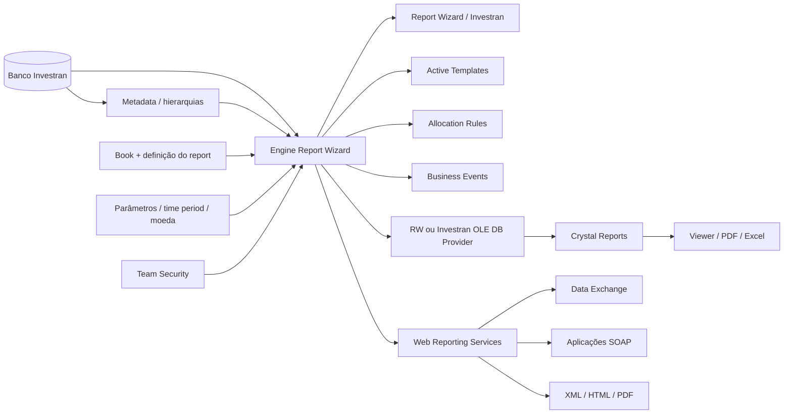
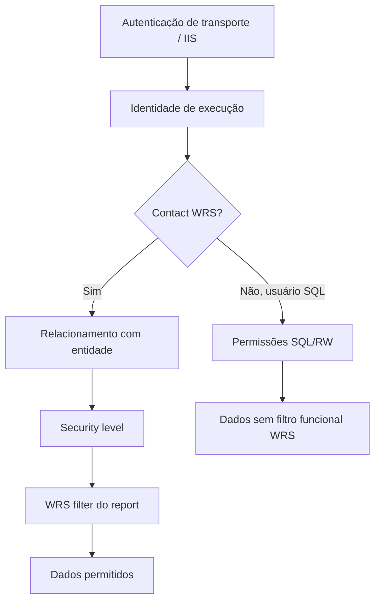

# Arquitetura de reporting

## Mapa dos componentes

## Caminhos de execução

| Caminho | Sequência | Identidade/segurança relevante |
|---|---|---|
| interativo | usuário -> Investran -> RW engine -> banco | login do Investran e Team Security |
| Crystal direto | usuário -> RW -> Crystal Viewer | acesso ao report e provider instalado |
| Crystal externo | Crystal -> OLE DB Provider -> RW engine -> banco | conta de conexão, RW User/Admin e parâmetros |
| WRS com Contact | consumidor -> IIS/WRS -> RW engine -> banco | Contact, relacionamento, security level e WRS filter |
| WRS com SQL user | consumidor -> IIS/WRS -> RW engine -> banco | usuário SQL; o manual alerta que filtros/security levels WRS não são aplicados |
| automação | AT/AR/BE -> report driver -> RW engine | conta do processo e contrato do driver report |

## Por que um report RW é um componente compartilhado

Um report pode ser simultaneamente interface humana, fonte de Crystal, driver de Active Template, fonte de Allocation Rule, dependência de Business Event ou contrato de integração. Alterar colunas, filtros, nomes, tipos ou cardinalidade pode afetar processos sem relação aparente com a tela do report.

## Fronteiras de segurança

Autenticar no IIS não prova autorização funcional no report. Da mesma forma, executar com conta administrativa ou SQL pode ocultar erros de configuração e gerar uma falsa validação.

## Diagnóstico por camada

| Camada | Sintoma típico | Evidência necessária |
|---|---|---|
| consumidor | chamada, paginação ou PDF inválido | request sanitizado, método, formato e response/fault |
| rede/TLS | WRS indisponível | DNS, porta, certificado, firewall e handshake |
| IIS/WRS | 5xx, recycle ou falha geral | logs IIS/aplicação, app pool, CPU e memória |
| configuração WRS | empresa/conexão não encontrada | `CompanyID`, mapeamento e teste de conexão |
| segurança | report ausente, vazio ou excessivo | Contact, relação, security level, filtro e identidade |
| parâmetros | vazio ou erro de tipo | ID, nome, tipo, formato e valor efetivo |
| definição RW | total/cardinalidade incorretos | versão, columns, filters, aggregation e hierarchy |
| engine/SQL | lentidão ou timeout | duração RW isolada, volume, plano e blocking |
| OLE DB/Crystal | RW funciona, layout falha | provider, Add Command, datasource, schema e subreports |
| automação | interativo funciona, job falha | conta do processo, versão publicada e contexto |

## Ordem de isolamento

1. Confirme ambiente, usuário e caminho de execução.
2. Execute o report RW base com os mesmos parâmetros.
3. Compare com conjunto conhecido e última versão boa.
4. Adicione uma camada por vez: provider, Crystal, WRS ou automação.
5. Valide segurança com usuário representativo e teste negativo.
6. Só depois investigue tuning de banco ou ampliação de timeout.

## Guias relacionados

- [Report Wizard - desenvolvimento e operação](02-report-wizard-desenvolvimento-operacao.md)
- [Web Reporting Services](03-web-reporting-services.md)
- [Report Wizard, Crystal Reports e WRS](../07-report-wizard-e-crystal.md)
- [Runbook - Falha de reporting](../../runbooks/falha-reporting.md)

## Fontes

- *Internal_Inv7_INV_RW_Dev_Guide_7.pdf*.
- *Internal_Inv7_INV_WRS_Install-Admin_7.pdf*.
- *Internal_Inv7_InWRS_API_Guide.pdf*.
- *Crystal Reports Guidebook.pdf*.
