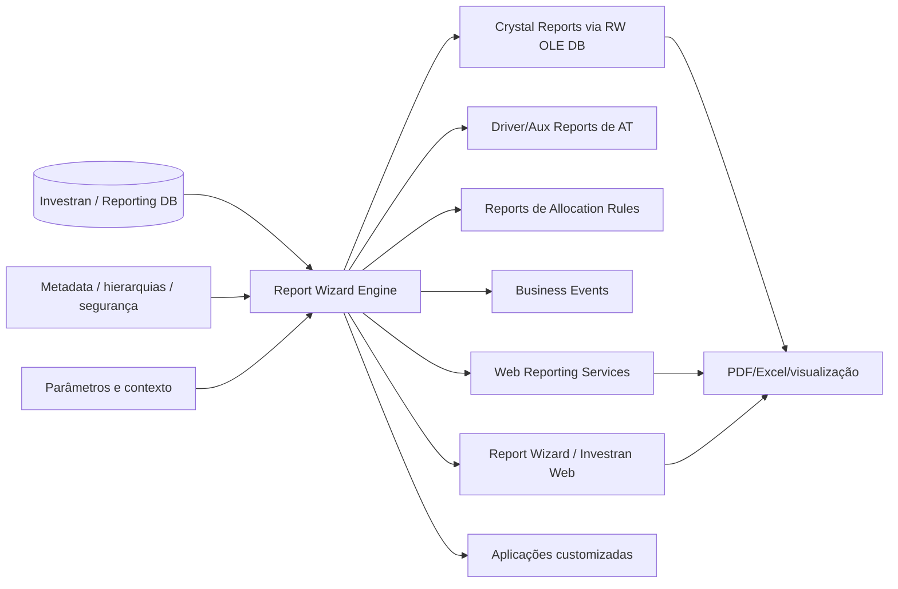

# Arquitetura de reporting

## Componentes e consumidores

## Por que um Report Wizard report é mais que um relatório

RW pode ser interface humana, fonte de Crystal, driver de Active Template, fonte de Allocation Rule ou dependência de Business Event. Alterar colunas, filtros, nomes, tipos ou cardinalidade pode afetar processos que não parecem relacionados ao report.

## Report Wizard

O guia de desenvolvimento descreve componentes como Connection, Metadata, Report, Book, Column, Column Filter, Parameter Set, Time Period e RWReport. Conceitualmente, a execução combina:

1. conexão e identidade;
2. metadata e campos disponíveis;
3. definição de report/columns;
4. filtros e parâmetros;
5. time period, currency e formatação;
6. engine e acesso ao banco;
7. consumidor e formato de saída.

## Crystal Reports

Crystal adiciona layout e recursos de apresentação sobre dados provenientes do RW. A associação pode ser direta ou externa por RW OLE DB Provider. Sempre valide o RW base antes de investigar layout, subreport ou viewer.

## Web Reporting Services

WRS permite que Data Exchange e aplicações customizadas executem reports RW. Envolve IIS/SSL, configuração de banco, usuários/contacts, security levels, parâmetros e publicação.

## Diagnóstico por camada

| Camada | Sintoma | Verificação |
|---|---|---|
| Segurança | report não aparece/sem dados | usuário, Team Security, pasta e contexto |
| Parâmetros | vazio ou erro de tipo | nome, tipo, default, vigência e formato |
| Definição RW | total/cardinalidade incorretos | columns, filters, aggregation, hierarchy |
| Engine/SQL | lento/timeout | volume, concorrência, plano, blocking |
| Crystal/OLE DB | RW funciona, layout falha | associação, provider, parâmetros, subreports |
| Scheduler/WRS | interativo funciona, agendado falha | conta, serviço, publicação, output path |

## Contrato de alteração

Antes de mudar um report, inventarie todos os consumidores e registre schema esperado: colunas, tipos, parâmetros, cardinalidade, totais e duração. Depois teste cada consumidor, não apenas a tela do Report Wizard.

## Fontes

- *Internal_Inv7_INV_RW_Dev_Guide_7.pdf*.
- *Crystal Reports Guidebook.pdf*.
- *Internal_Inv7_INV_WRS_Install-Admin_7.pdf*.
- *Internal_Inv7_InWRS_API_Guide.pdf*.
