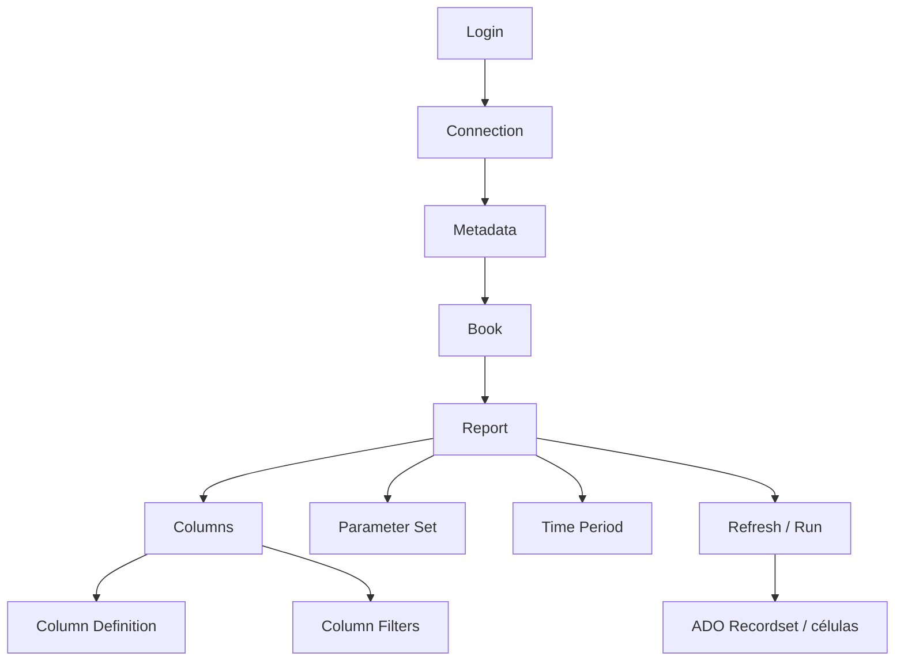

# Report Wizard - desenvolvimento e operação

## O que é o Report Wizard

O Report Wizard é o mecanismo de reporting do Investran. Ele combina metadados, definição de report, colunas, filtros, parâmetros e períodos para produzir um recordset. Esse resultado pode ser consumido pela interface do Investran, pelo Crystal Reports, por componentes COM, pelo OLE DB Provider ou pelo Web Reporting Services.

## Modelo conceitual

| Componente | Função operacional |
|---|---|
| `Login` | testa a conexão e fornece a connection string |
| `Connection` | conecta ao banco, carrega metadata e reports e executa operações auxiliares |
| `Metadata` | representa os metadados disponíveis no banco |
| `Book` | pasta lógica que organiza reports |
| `Report` | definição executável, incluindo colunas, parâmetros e propriedades |
| `Column` | campo selecionado, com formatação, agregação e ordenação |
| `ColumnDefinition` | definição de metadata usada pela coluna |
| `ColumnFilter` | operador e valor usados para restringir resultados |
| `ParameterSet` | coleção de parâmetros e valores fornecidos na execução |
| `TimePeriod` | período e datas usados em cálculos temporais |
| `RWConnection` / `RWReport` | wrappers que simplificam conexão, parâmetros, execução e cache |

Nem todo método público dos componentes é suportado para customizações. O guia informa que APIs internas ou não documentadas não possuem garantia de compatibilidade futura.

## Ciclo de desenvolvimento de um report

### 1. Definir o contrato

Antes de abrir o designer, registre:

- pergunta de negócio que o report deve responder;
- granularidade esperada: uma linha por entidade, investor, deal, position ou transação;
- data de corte e moeda;
- filtros obrigatórios e opcionais;
- colunas e tipos esperados;
- regras de subtotal e total;
- consumidores e formatos de saída;
- volume e tempo máximo aceitável.

### 2. Escolher o book e o nome

Use nomes curtos, claros e estáveis. Para reports consumidos via Crystal/OLE DB, evite pontos e caracteres especiais. O comando do provider referencia o report pelo par `Book.Report`; renomear qualquer parte pode quebrar consumidores.

### 3. Selecionar colunas e definir a granularidade

Comece pelas chaves que determinam a linha do resultado. Depois adicione descrições, valores e cálculos. Cada nova relação ou nível hierárquico pode multiplicar linhas; valide cardinalidade antes de incluir apresentação.

### 4. Configurar filtros e parâmetros

Parâmetros tornam um report reutilizável. Documente nome, ID, tipo, descrição, valor padrão, obrigatoriedade e formato. A descrição deve orientar claramente o usuário. No WRS, parâmetros também são combinados com os relacionamentos e security levels do contato.

### 5. Configurar agregação, ordenação e período

Defina explicitamente:

- campos de agrupamento;
- `RowAggregation` e subtotais;
- direção de ordenação;
- moeda e escala;
- tipo de período, como LTD, YTD, MTD, DTD ou dia específico;
- comportamento para valores nulos e ausência de dados.

### 6. Validar isoladamente

Execute com um conjunto pequeno e conhecido. Reconcilie quantidade de linhas, totais, sinal contábil, moeda e data. Só associe Crystal, WRS ou outro consumidor depois que o report base estiver validado.

## Execução programática

### INVDEV Library

O fluxo básico é:

1. criar `INVDEV70.Connection`;
2. chamar `RefreshMetadata(connectionString, user)`;
3. carregar o report com `LoadReport(bookName, reportName)`;
4. localizar e preencher parâmetros em `ParameterSet`;
5. executar `Report.Refresh(connection)`;
6. processar o `ADO Recordset` retornado;
7. liberar report, metadata e conexão.

### Wrappers RW

Com `ftiRW70.RWConnection` e `RWReport`:

1. inicialize `RWConnection`;
2. carregue o report;
3. atribua parâmetros por nome;
4. execute `Run`;
5. leia `Rows`, `Cols` e `Cell(row, col)`;
6. finalize com `Terminate`.

### Regras de threading

Os componentes do Report Wizard são COM/VB6, não são thread-safe e devem ser criados e usados na mesma thread STA.

- ASP.NET clássico: a documentação orienta `AspCompat="true"` para a página.
- ASMX: exige handler compatível com STA.
- WCF: exige pool/fila de threads STA e sincronização explícita.
- Não armazene instâncias RW em `Session` ou `Application`, pois outra requisição pode usar outra thread.
- Nunca compartilhe a mesma instância entre execuções concorrentes.

Falhas intermitentes sob carga, travamentos e resultados cruzados podem indicar violação dessas regras, não necessariamente problema no SQL.

## OLE DB Provider e Crystal Reports

Existem referências ao provider mais novo do Investran e ao provider legado do Report Wizard. Confirme qual está instalado e suportado no ambiente.

Para Crystal:

1. crie e valide o report RW antes da associação;
2. conecte pelo `Investran RW OLE DB Provider`;
3. use **Add Command** para referenciar `Book.Report`;
4. associe parâmetros do Crystal aos parâmetros RW;
5. valide joins, command flags e subreports;
6. ao alterar o schema RW, execute **Verify Database** e remapeie campos quando necessário.

O guidebook recomenda não usar a Tree View para vincular reports RW; o Add Command oferece o controle necessário para joins e parâmetros.

## Associação direta e externa com Crystal

| Associação | Quem executa | Uso típico |
|---|---|---|
| Direta | engine RW, que entrega o resultado ao Crystal Viewer | report integrado e aberto no contexto do RW |
| Externa | Crystal Reports por meio do RW OLE DB Provider | joins, parâmetros e composição controlados pelo Crystal |

Em Crystal Dynamic Reporting, diferencie:

- **shell report:** layout Crystal publicado ao usuário;
- **driver reports:** reports RW que fornecem os dados.

No WRS, shell e drivers devem possuir filtros e security levels idênticos, mas somente o shell precisa ter `Publish Report` marcado.

## Performance

Meça antes de alterar. Capture report/book, usuário, parâmetros, horário, duração, linhas retornadas e concorrência.

Investigue nesta ordem:

1. filtro ausente ou parâmetro amplo;
2. granularidade e multiplicação de linhas;
3. colunas calculadas, hierarquias e agregações;
4. joins entre múltiplos reports;
5. subreports repetidos;
6. chamadas concorrentes e serialização STA;
7. blocking e plano de execução no SQL;
8. limite/timeout do consumidor.

Não trate aumento de timeout como correção permanente e não crie índices sem análise e aprovação do DBA.

## Versionamento e publicação

Para cada mudança:

- exporte ou duplique a versão anterior;
- registre ticket, autor, data e motivação;
- compare o contrato antes/depois;
- valide em DEV e UAT com parâmetros representativos;
- teste consumers downstream;
- mantenha evidências de totais e duração;
- defina rollback pela restauração da última versão aprovada.

## Checklist de troubleshooting

1. Reproduza com o mesmo usuário, book, report e parâmetros.
2. Teste um usuário administrativo somente para isolar segurança, sem usar esse resultado como validação final.
3. Execute o RW base sem Crystal/WRS.
4. Compare parâmetros, colunas e versão com a última versão boa.
5. Se falhar apenas sob carga, revise STA, concorrência e pool de threads.
6. Se o RW funciona e o Crystal falha, verifique provider, Add Command, datasource, Verify Database, parâmetros e subreports.
7. Se o resultado estiver vazio, diferencie ausência real de dados de filtro/security context incorreto.
8. Se estiver lento, capture volume, duração e evidência de SQL blocking.

## Fontes

- *Internal_Inv7_INV_RW_Dev_Guide_7.pdf*, capítulos InvDev Library Overview, componentes e Report Execution Examples.
- *Crystal Reports Guidebook.pdf*, seções de integração, Add Command, joins, subreports, mudanças e Reporting Services.
