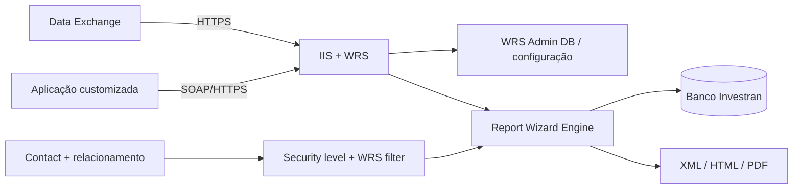
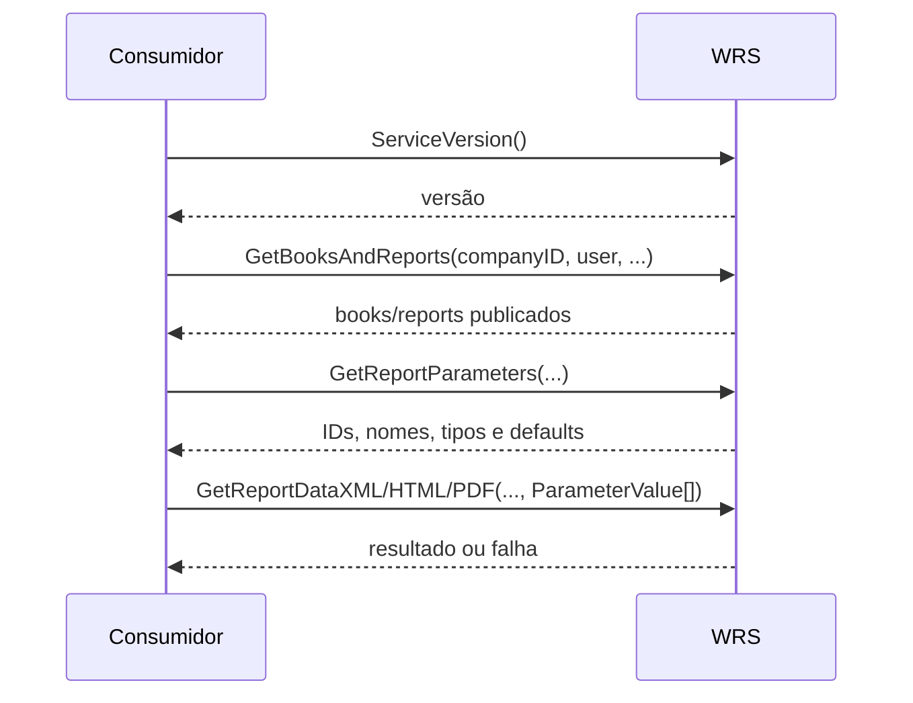

# Web Reporting Services - arquitetura, segurança e suporte

## Objetivo

O Investran Web Reporting Services (WRS) permite executar reports do Report Wizard em tempo real por meio do Data Exchange ou de aplicações customizadas. A interface documentada é um Web Service legado que expõe descoberta de reports, parâmetros e execução com saída XML, HTML ou PDF.

WRS não é a Web API REST construída pela equipe. São integrações distintas, com autenticação, contratos e troubleshooting diferentes.

## Arquitetura



## Componentes e dependências

| Componente | Responsabilidade | Verificações de suporte |
|---|---|---|
| IIS / site WRS | hospedar o Web Service | site, binding HTTPS, app pool, ISAPI/ASP e logs |
| certificado SSL | criptografar o tráfego | validade, cadeia, hostname e binding |
| WRS Admin database | armazenar configurações administrativas | conexão, disponibilidade e versão |
| configuração da empresa | mapear `CompanyID` ao banco do Investran | server, database, company name e teste de conexão |
| usuário WRS | acesso SQL usado pelo serviço | senha, lock, permissão e política da conta |
| Report Wizard | definir e executar o report | book, report, parâmetros e performance |
| Contact | identidade funcional do consumidor | e-mail principal e `WebServicesEnabled` |
| relacionamento | vincular o Contact a Legal Entity, Investor ou Specific Investor | entidade, role e vigência |
| security level | limitar disponibilidade, parâmetros e dados | correspondência entre contato e report |
| WRS filter | definir nível de saída | Legal Entity, Investor ou Specific Investor |

## Instalação e configuração

O procedimento documentado inclui:

1. instalar e configurar o IIS;
2. habilitar ASP e extensões ISAPI exigidas pela versão;
3. habilitar WRS no banco do Investran pelo parâmetro `UseERW`;
4. criar/configurar o WRS Admin database;
5. configurar o usuário de serviço WRS;
6. instalar os componentes WRS e, quando aplicável, Crystal;
7. cadastrar a conexão com o banco do Investran;
8. testar a conexão e registrar o `CompanyID` atribuído;
9. configurar hostname, path, porta e protocolo no consumidor/Data Exchange;
10. validar o acesso fim a fim por HTTPS.

O manual antigo menciona ASP, ISAPI e Windows Server 2008. Não replique essa configuração sem validar a arquitetura e a versão realmente implantadas.

### Valores que precisam constar no inventário de cada ambiente

- hostname/FQDN e URL do WRS;
- site, aplicação, app pool e identidade no IIS;
- certificado e data de expiração;
- caminho virtual, porta e protocolo;
- `CompanyID`, nome lógico da empresa, servidor e banco;
- banco administrativo WRS;
- conta de serviço e cofre responsável;
- versões dos componentes WRS, RW e Crystal;
- diretórios de logs e owners operacionais.

Não registre senhas ou chaves nesta base.

## Modelo de segurança

O acesso efetivo resulta da interseção de quatro elementos:

```text
Contact habilitado
  + relacionamento com uma entidade
  + security level atribuído ao relacionamento
  + mesmo security level e filtro configurados no report
  = report visível e dados permitidos
```

### Preparação de um usuário

1. Criar os security levels necessários.
2. Garantir que o Contact possua e-mail principal.
3. Marcar `WebServicesEnabled` no Contact.
4. Criar o relacionamento do Contact com Legal Entity, Investor ou Specific Investor e atribuir a role.
5. Atribuir um ou mais security levels ao relacionamento.
6. Se houver Data Exchange, criar/habilitar o usuário e configurar os relacionamentos correspondentes.

O privilégio de publicar reports e administrar security levels requer o entitlement `WebRS Report Publisher` no Team Security, conforme o manual.

### Efeito dos filtros

| WRS filter do report | Relação necessária para saída nesse nível |
|---|---|
| Legal Entity | relação direta ou relação que possa ser resolvida até uma Legal Entity permitida |
| Investor | relação de Investor; combinações sem Investor podem não produzir seleção/saída |
| Specific Investor | relação de Specific Investor; relações somente de Legal Entity ou Investor não bastam |

Um usuário pode ter security levels diferentes em relacionamentos diferentes. Portanto, “o Contact tem acesso” não é uma validação suficiente; confirme a entidade, o relacionamento e o security level usados na execução.

## Publicação de um report no WRS

Pré-requisitos:

- report RW validado;
- parâmetros aplicados como filtros quando necessário;
- descrição clara para cada parâmetro;
- WRS filter coerente com o público;
- security level criado e atribuído aos relacionamentos de teste;
- formato de saída suportado.

Procedimento documentado:

1. abrir o report no Report Wizard;
2. acessar **Tools > Report Options**;
3. abrir a aba **Web Reporting Services**;
4. definir `WRS Filters` como Legal Entity, Investor, Specific Investor ou combinação aplicável;
5. selecionar um ou mais `WRS Security Levels`;
6. marcar `Publish Report`;
7. salvar o report;
8. validar que aparece como publicado e executar com um Contact representativo.

Para Crystal Dynamic Reporting, configure filtros e security levels de forma idêntica no shell e nos drivers. Marque `Publish Report` somente no shell.

## Interface SOAP do WRS

A URL documentada segue o padrão legado:

```text
https://<host>:<port>/<path>/FTIRWWS.dll?Handler=Default
```

O consumidor configura credenciais de rede para o serviço. Use HTTPS e restrinja o firewall aos consumidores autorizados.

### Métodos documentados

| Método | Retorno | Uso |
|---|---|---|
| `ServiceVersion()` | string | obter versão do Web Service |
| `GetBooksAndReports(...)` | XML | listar books e reports publicados no WRS |
| `GetReportParameters(...)` | XML | listar parâmetros e seus IDs/tipos |
| `GetReportDataXML(...)` | XML | executar report e retornar dados estruturados |
| `GetReportDataXMLLocalizedDate(...)` | XML | executar com formato de data localizado |
| `GetReportDataHTML(...)` | HTML | executar e retornar documento HTML |
| `GetReportDataHTMLLocalizedDate(...)` | HTML | executar HTML com formato de data informado |
| `GetReportDataHTMLFirstPage(...)` | HTML + IDs de saída | executar e obter a primeira página |
| `GetReportDataHTMLPage(...)` | HTML | recuperar outra página da execução |
| `GetReportDataPDF(...)` | `byte[]` | executar e retornar o PDF |

Os métodos recebem, conforme a operação, `companyID`, usuário, senha, `bookName`, `reportName` e uma coleção de `ParameterValue` contendo `id` e `value`.

### Sequência de integração recomendada



Não grave IDs de parâmetro presumindo que serão iguais em todos os ambientes. Descubra-os pelo contrato publicado e valide-os após promoção ou mudança do report.

## Identidade SQL versus Contact

O guia diferencia duas formas de informar o usuário:

- usuário SQL Server: executa com a identidade informada, mas o manual alerta que filtros e security levels WRS do report não são aplicados;
- e-mail de um Contact habilitado: permite aplicar os relacionamentos, filtros e security levels, ficando a autenticação sob responsabilidade da aplicação consumidora.

Essa diferença é crítica. Nunca use uma execução com usuário SQL como prova de que a segurança funcional do Contact está correta.

## Formatos e volume

### XML

Indicado para integração e transformação de dados. O manual recomenda filtrar reports com mais de 1.000 linhas para evitar timeout durante a construção de XML. Trate esse número como orientação histórica, não como SLA atual.

### HTML

Pode ser retornado integralmente ou paginado. Na paginação:

- `GetReportDataHTMLFirstPage` devolve `reportProcessId` e `totalPages`;
- `GetReportDataHTMLPage` usa `pageNumber` e o mesmo `reportProcessId`;
- formatos de data documentados incluem `DD-MM-YYYY`, `MM-DD-YYYY` e `YYYY-MM-DD`.

### PDF

`GetReportDataPDF` devolve um `byte[]`. O consumidor deve definir `Content-Type: application/pdf`, transmitir o binário sem conversão textual e controlar tamanho, timeout e armazenamento.

## Monitoramento recomendado

Colete, sem payloads sensíveis:

- timestamp UTC e correlation ID do consumidor;
- hostname, `CompanyID`, book e report;
- identidade funcional/Contact usada;
- parâmetros sanitizados;
- formato, duração e tamanho do resultado;
- status HTTP/SOAP fault;
- app pool recycle, CPU e memória;
- latência/erro de conexão com o banco;
- duração do report RW isolado.

## Troubleshooting por sintoma

| Sintoma | Verificações principais |
|---|---|
| WRS indisponível | DNS, rede, firewall, certificado, binding IIS, site e app pool |
| conexão com empresa falha | `CompanyID`, configuração WRS, servidor, banco, conta e teste de conexão |
| report não aparece | publicação, book/report, security level, Contact e relacionamento |
| parâmetros vazios | definição/descrição, filtro WRS, relacionamento e security level |
| report retorna dados demais | tipo de identidade, filtros e segurança funcional não aplicados |
| report retorna vazio | parâmetro, relacionamento, nível do filtro, data e ausência real de dados |
| XML causa timeout | volume, filtros, duração RW e tamanho da serialização |
| primeira página funciona e demais falham | `reportProcessId`, `pageNumber`, expiração/estado da execução e afinidade |
| PDF inválido | shell/Crystal, binário truncado, timeout e `Content-Type` |
| funciona no RW, falha no WRS | publicação, identidade, IIS, WRS config e serialização/formato |

## Checklist de mudança

1. Identifique consumidores e janela de uso.
2. Registre configuração e versão atuais.
3. Salve a versão do report e faça backup da configuração aplicável.
4. Teste a mudança fora de produção.
5. Valide descoberta, parâmetros e cada formato utilizado.
6. Teste Contacts de cada nível de relacionamento relevante.
7. Faça testes negativos para provar isolamento de dados.
8. Compare duração e volume com o baseline.
9. Publique e monitore.
10. Reverta se houver exposição indevida, quebra de contrato ou divergência financeira.

## Fontes

- *Internal_Inv7_INV_WRS_Install-Admin_7.pdf*, seções Introduction, Installation, Users e Reports.
- *Internal_Inv7_InWRS_API_Guide.pdf*, seções Interface Specifications e Web Service Interface Methods.
- *Internal_Inv7_INV_RW_Dev_Guide_7.pdf*, seção Executing Reports from Web Applications.
