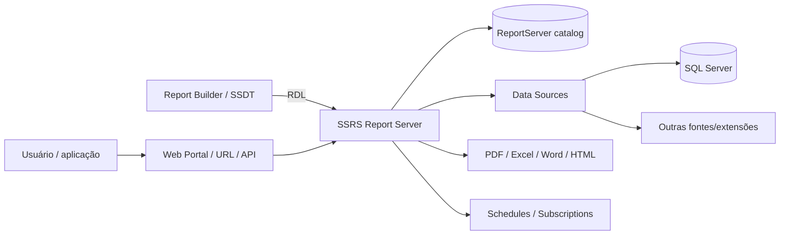
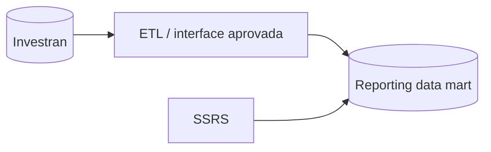
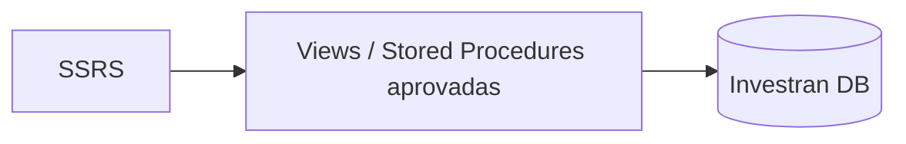
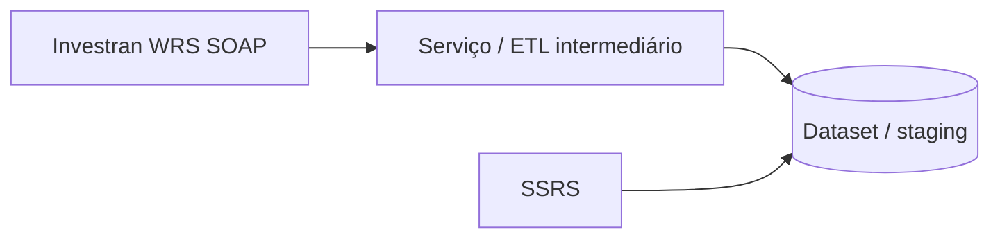

# Microsoft SQL Server Reporting Services (SSRS)

Este documento diferencia o **Microsoft SQL Server Reporting Services (SSRS)** do **Investran Web Reporting Services (WRS)** e descreve possibilidades seguras de uso no ecossistema Investran.

> Nenhum dos manuais Investran fornecidos confirma uma integração oficial direta com SSRS. Os padrões abaixo são opções arquiteturais que precisam ser validadas com FIS, arquitetura, DBA e segurança antes de implementação.

## O que é SSRS

SSRS é a plataforma de reporting da Microsoft para criar, publicar, administrar e distribuir relatórios paginados. Uma definição `.rdl` descreve data sources, datasets/queries, parameters, expressions e layout.

Em Native Mode, o Report Server armazena reports, shared data sources, datasets, schedules e subscriptions. Usuários podem acessar conteúdo pelo web portal, URL access ou aplicações integradas. A plataforma também oferece SOAP Web Service e REST APIs para administração e integração.

## WRS não é SSRS

| Tema | Investran WRS | Microsoft SSRS |
|---|---|---|
| fornecedor | FIS/SunGard | Microsoft |
| fonte principal | Report Wizard Engine | datasets/data sources configurados no SSRS |
| definição do report | report RW e possível Crystal `.rpt` | Report Definition Language `.rdl` |
| endpoint | WRS SOAP `FTIRWWS` | Report Server portal, URL access, SOAP e REST |
| segurança funcional | Contact, Relationship, Security Level e Report Filter | roles/policies do Report Server e credenciais do data source |
| distribuição | XML, HTML e PDF via serviço/consumidor | portal, exportação, subscriptions, email e file share |
| uso típico | expor reports Investran com segurança funcional | plataforma corporativa de reports paginados |

Não aplique configurações, logs ou runbooks de um produto ao outro. Ambos podem usar conceitos como parameters, web service e PDF, mas são stacks independentes.

## Arquitetura do SSRS

Componentes principais:

- **Report Server:** processa e renderiza reports;
- **Web Portal:** organiza e permite executar conteúdo;
- **Report Builder/SSDT:** autoria de `.rdl`;
- **Data Source:** conexão e credenciais;
- **Dataset:** query e fields;
- **ReportServer database:** catálogo, configuração e histórico operacional;
- **Schedules/Subscriptions:** execução e entrega automatizada;
- **Web Service/REST/URL access:** interfaces programáticas.

## Possíveis padrões com Investran

### Padrão A - SSRS sobre data mart ou camada de reporting

É o padrão mais isolado para analytics e distribuição corporativa. Reduz o acoplamento do SSRS ao schema transacional do produto.

Valide:

- latência e frequência de carga;
- reconciliação com Investran;
- lineage e ownership;
- segurança/mascaramento;
- reprocessamento;
- retenção e histórico.

### Padrão B - SSRS sobre views ou procedures aprovadas

Só utilize se a FIS e os owners do ambiente aprovarem os objetos e o contrato. Consultar tabelas internas diretamente cria risco de mudança de schema, leitura inconsistente, contenção e interpretação incorreta do domínio.

Requisitos mínimos:

- usuário read-only dedicado;
- objetos estáveis e documentados;
- parâmetros obrigatórios para limitar escopo;
- timeout e volume controlados;
- testes após upgrades/MRs;
- monitoramento de bloqueio e duração.

### Padrão C - Aplicação intermediária consumindo WRS

Uma camada intermediária pode executar reports autorizados no WRS, transformar XML e persistir um dataset consumível pelo SSRS. Isso preserva a lógica de publicação/segurança do WRS, mas cria responsabilidades de cache, identidade, auditoria e atualização.

Não assuma que SSRS consome diretamente o endpoint WRS sem adaptação. Valide formato, autenticação, paginação, volume, timeout e tratamento de falhas.

### Padrão D - SSRS como distribuição de um dataset existente

Quando outro processo já produz dados reconciliados, SSRS pode cuidar apenas de layout, parâmetros, exportação e subscriptions.

Esse padrão é útil quando o cálculo permanece no Investran/RW e a distribuição corporativa precisa de recursos do SSRS.

## Como escolher

| Necessidade | Componente preferencial |
|---|---|
| executar report RW preservando Contact/Relationship/Report Filter | WRS |
| layout Crystal já associado ao RW | RW + Crystal/WRS |
| portal corporativo de `.rdl` | SSRS |
| subscriptions por email/file share | SSRS |
| integração online com segurança funcional Investran | WRS |
| relatório corporativo sobre data mart governado | SSRS |
| Active Template ou Allocation Rule consumindo report | Report Wizard |

WRS e SSRS podem coexistir. A escolha depende de onde vivem cálculo, autorização, dados e distribuição.

## Desenvolver um report SSRS

### 1. Definir contrato

Registre finalidade, audiência, fonte, granularidade, parameters, SLA, formato e owner.

### 2. Criar Data Source

Prefira shared data source quando múltiplos reports usam a mesma conexão. Separe conexão de definição `.rdl` para permitir manutenção centralizada.

Não coloque senha no repositório. Use o mecanismo aprovado de credenciais do Report Server.

### 3. Criar Dataset

Use query parametrizada e retorne somente columns necessárias. Evite `SELECT *`. Confirme tipos, cardinalidade e tempo.

### 4. Criar Parameters

Defina tipo, defaults, available values, dependências e tratamento de múltiplos valores. Parameters devem restringir dados no dataset, não apenas ocultar linhas no layout.

### 5. Montar layout paginado

Use tablix, grupos, headers/footers, expressions e page breaks. Teste PDF e Excel separadamente.

### 6. Publicar

Publique `.rdl`, shared data sources e datasets no folder correto. Configure permissões e teste com usuário não administrativo.

### 7. Configurar subscription

Subscriptions executam e entregam reports em agenda. Data-driven subscriptions podem obter destinatários, parameter values, formato e opções de entrega de uma fonte externa, conforme edição/licenciamento.

### 8. Validar

- parâmetros e segurança;
- dados e totais;
- PDF/Excel;
- timezone e agenda;
- entrega e destinatários;
- volume e concorrência;
- logs de execução.

## Interfaces programáticas

### URL access

Permite executar/navegar reports por URL com path e parameters. Use para integração simples e controlada; não coloque segredos em query strings.

### SOAP Web Service

Expõe funcionalidades do Report Server para aplicações e ferramentas administrativas. É diferente do SOAP do Investran WRS.

### REST API

Permite navegar pelo catálogo e criar, atualizar, baixar ou excluir objetos do Report Server. Controle permissões e evite automações destrutivas sem versionamento.

## Segurança

Avalie separadamente:

- acesso ao portal/folders/reports;
- credencial usada pelo Data Source;
- segurança na própria query/view;
- parameters e filtros;
- subscriptions e destinos;
- arquivos exportados;
- service accounts e encryption keys;
- TLS e URLs do Report Server.

Permissão para abrir um report não significa automaticamente que a fonte aplica segurança por entidade como o WRS. Se o requisito é limitar Legal Entity/Investor por usuário, implemente e teste esse controle explicitamente.

## Operação e monitoramento

Inventarie:

- servidor/instância e versão;
- URLs do Web Service e Web Portal;
- ReportServer databases;
- service account;
- encryption key backup;
- folders, roles e owners;
- shared data sources;
- schedules/subscriptions;
- SMTP/file shares;
- retenção de logs;
- backup/restore e disaster recovery.

Monitore disponibilidade, falhas de execução, duração, filas, subscriptions, entrega, database, disco, memória, CPU e certificados.

## Troubleshooting

| Sintoma | Verificar |
|---|---|
| portal indisponível | serviço, URLs, certificado, HTTP.SYS e logs |
| report abre, mas falha ao executar | Data Source, credenciais, query e parameters |
| usuário vê report indevido | folder/item permissions e herança |
| usuário vê dados indevidos | query, row-level security e identidade do Data Source |
| subscription não entrega | schedule, SQL Agent aplicável, SMTP/share e credenciais |
| PDF correto, Excel ruim | layout, merged cells, widths e renderer |
| report lento | query, dataset, parameters, volume, expressions e concorrência |
| funciona no designer, falha no servidor | versão/extensões, Data Source e permissões do Report Server |
| diverge do Investran | data mart/carga, data de corte, regra e reconciliação |

## Publicação e rollback

Versione `.rdl`, queries/procedures, shared datasets e instruções de Data Source sem credenciais.

Antes do deploy:

- exporte a versão publicada;
- preserve configuração anterior;
- valide dependências;
- publique em ambiente inferior;
- teste usuários/roles;
- teste subscriptions;
- defina restauração de `.rdl` e objetos de dados.

Uma reversão de `.rdl` não corrige automaticamente uma procedure, view, Data Source ou subscription alterada no mesmo release.

## Perguntas de KT

- SSRS existe no ambiente? Qual versão/edição?
- Quais reports estão relacionados ao Investran?
- Qual padrão de integração é utilizado?
- A fonte é database, data mart, WRS ou outra interface?
- Quais users/service accounts e cofres?
- Onde estão `.rdl`, queries e pipelines versionados?
- Quais subscriptions são críticas?
- Como são aplicadas segurança por Legal Entity/Investor e reconciliação?
- Quais SLAs, volumes, janelas e runbooks?
- Como executar backup, restore e rollback?

## Referências

- [Microsoft Learn - Reporting Services concepts](https://learn.microsoft.com/en-us/sql/reporting-services/reporting-services-concepts-ssrs?view=sql-server-ver17)
- [Microsoft Learn - Reporting Services reports](https://learn.microsoft.com/en-us/sql/reporting-services/reports/reporting-services-reports-ssrs?view=sql-server-ver17)
- [Microsoft Learn - Developer documentation](https://learn.microsoft.com/en-us/sql/reporting-services/reporting-services-developer-documentation?view=sql-server-ver17)
- [Microsoft Learn - URL access](https://learn.microsoft.com/en-us/sql/reporting-services/url-access-ssrs?view=sql-server-ver17)
- [Microsoft Learn - Supported data sources](https://learn.microsoft.com/en-us/sql/reporting-services/report-data/data-sources-supported-by-reporting-services-ssrs?view=sql-server-ver17)
- [Microsoft Learn - Data-driven subscriptions](https://learn.microsoft.com/en-us/sql/reporting-services/subscriptions/data-driven-subscriptions?view=sql-server-ver17)
