# Report Wizard - guia prático de desenvolvimento e uso

Este guia apresenta o ciclo de um report do Report Wizard (RW): definir o contrato, escolher dados, configurar parâmetros, validar a granularidade, consumir o report em outras ferramentas e diagnosticar problemas.

> O guia de desenvolvimento do RW é predominantemente técnico e descreve a INVDEV Library. As telas de integração e layout vêm do Crystal Reports Guidebook. As legendas identificam claramente qual ferramenta aparece em cada imagem.

## O que o Report Wizard faz

O Report Wizard consulta o modelo de dados do Investran usando metadata controlada, organiza columns, filters, parameters e time periods e entrega um conjunto tabular de resultados.

Esse resultado pode ser usado por usuários no RW, Crystal Reports, Active Templates, Allocation Rules, Web Reporting Services e aplicações que usam INVDEV/RWReport ou OLE DB.

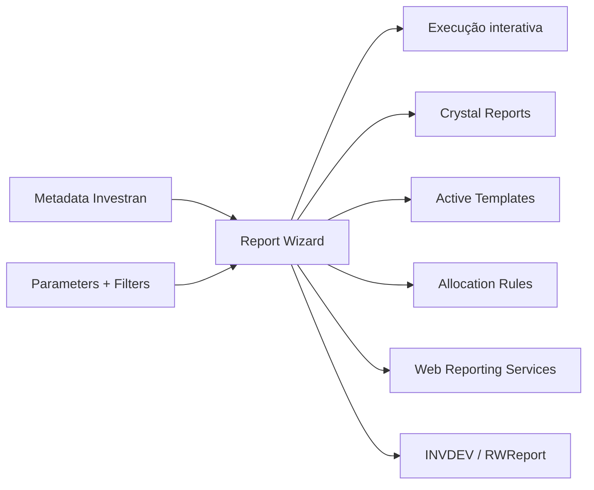

Um report RW funciona como contrato compartilhado. Alterar nome, column, tipo, ordem, parameter ou granularidade pode afetar vários consumidores.

## Antes de criar ou alterar

Registre:

- finalidade, owner e consumidores;
- Book e nome;
- o que cada linha representa;
- columns obrigatórias e tipos;
- filters e parameters;
- time periods;
- ordenação, agregação e subtotais;
- volume e tempo esperado;
- formatos de saída;
- baseline aprovada.

Se você não consegue completar a frase “cada linha representa…”, ainda não definiu a granularidade.

## Elementos principais

### Book

Book é a pasta que contém reports e participa da segurança e identificação programática. Um report pertence a um único Book.

Use nomes estáveis. Alterar Book/report pode quebrar referências em Crystal, ATM, ARM, WRS, OLE DB ou chamadas `Reports.Item`.

### Columns

Cada column possui nome, heading, tipo, formato, visibilidade, agregação, filtro e possivelmente time period.

Antes de adicionar uma column, determine:

- se altera a granularidade;
- se deve retornar lookup text ou ID;
- se aparece ou apenas filtra;
- se será totalizada;
- se algum consumidor depende da posição;
- se precisa de timeframe.

Para ARM/ATM, ordem e tipo podem ser parte obrigatória do contrato.

### Filters

Filters restringem resultados usando valores fixos ou Parameters. Valide operadores, `Null`, datas, lookup ID/text e AND/OR. Um filtro incorreto pode excluir dados sem produzir erro.

### Parameters

Parameters são placeholders preenchidos em runtime, com nome, tipo, lookup, default e obrigatoriedade.

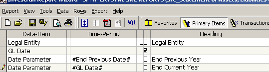

*Tela do Report Wizard com Parameters. O nome exato faz parte do contrato com Crystal, ATM, ARM e integrações. Fonte: Crystal Reports Guidebook, p. 30.*

Regras práticas:

- nomes significativos e estáveis;
- tipo e lookup corretos;
- defaults que não ampliem silenciosamente o escopo;
- mesmo nome quando houver propagação automática;
- comportamento de vazio, `Null` e múltipla seleção documentado.

### Time Periods

Time Period define a janela temporal de uma column, como LTD, YTD, MTD ou intervalos relativos/absolutos. Ao diagnosticar divergência, confirme From/To, limites inclusivos e o campo temporal usado.

### Calculated Columns

Calculated Columns derivam valores de outras columns. Teste tipos, divisão por zero, `Null`, escala e arredondamento. Se a lógica for compartilhada, evite duplicar fórmulas divergentes.

## Criar um report passo a passo

### 1. Escolher Book e nome

Crie no Book correto considerando segurança, finalidade e consumidores. Registre owner e dependências.

### 2. Definir entidade raiz e granularidade

Comece pelo menor conjunto capaz de identificar uma linha. Exemplos: uma linha por Investor, Position, Deal/Legal Entity, Transaction ou Investor/Closing Date.

### 3. Adicionar Columns gradualmente

Após cada grupo de columns:

1. execute;
2. compare row count;
3. procure duplicidades;
4. valide IDs/textos;
5. confira totals;
6. explique qualquer mudança de cardinalidade.

### 4. Configurar Parameters e Filters

Defina Parameters e associe-os aos filters. Teste valores normais, extremos, ausência de dados, defaults, vazio/`Null` e múltiplas entidades quando suportado.

### 5. Ordenação, agregação e subtotais

Ordenação deve ser determinística quando outro processo percorre as linhas. Agregações precisam respeitar a granularidade e o significado contábil.

### 6. Validar isoladamente

Antes de conectar a outro componente:

- execute com parâmetros reais;
- valide row count e tempo;
- reconcilie uma amostra;
- confirme columns, ordem e tipos;
- exporte e revise;
- compare com baseline.

## Associar um layout Crystal

No Report Wizard, acesse `Tools > Report Options` e associe o `.rpt` conforme o processo do ambiente.

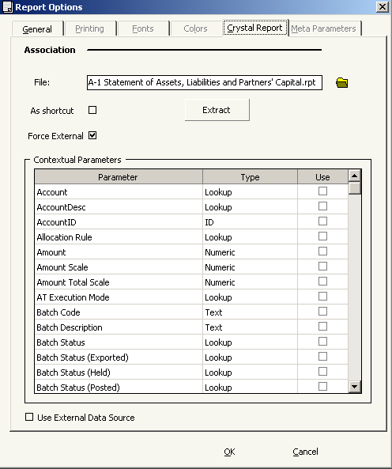

*Report Options do RW com arquivo Crystal associado e Control Parameters. Fonte: Crystal Reports Guidebook, p. 34.*

Antes de associar, valide o RW, preserve o `.rpt` anterior, confira parâmetros, conexão, permissões e caminho do arquivo no destino.

## Como RW e Crystal trabalham juntos

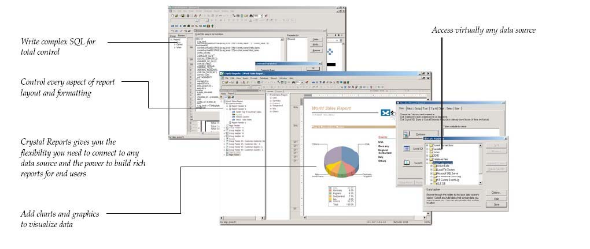

*RW fornece dados; Crystal organiza layout, fórmulas, grupos e distribuição. Fonte: Crystal Reports Guidebook, p. 4.*

| Responsabilidade | Componente principal |
|---|---|
| seleção, filters e granularidade | Report Wizard |
| layout, seções e paginação | Crystal Reports |
| grupos e fórmulas de apresentação | Crystal Reports |
| execução web e distribuição | WRS/consumidor |

Se o conteúdo está errado, valide primeiro o RW. Se os dados estão corretos e a apresentação está errada, investigue Crystal.

## Conectar Crystal ao RW

### 1. Criar o documento

Abra Crystal e escolha o wizard do Crystal ou Blank Report.

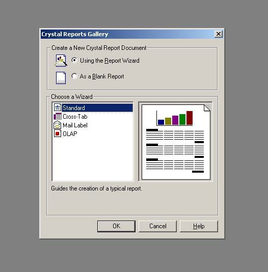

### 2. Abrir Database Expert

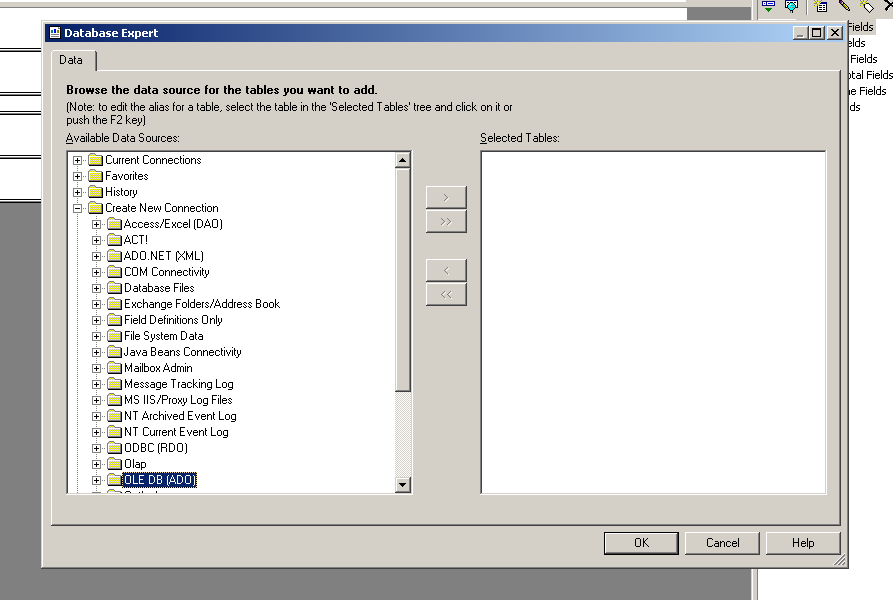

### 3. Selecionar o provider

Escolha o Investran RW OLE DB Provider compatível com a versão.

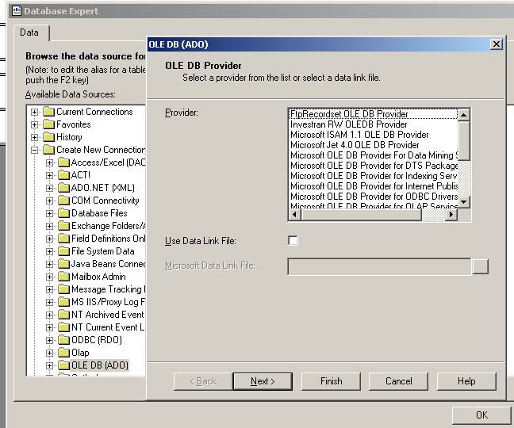

### 4. Informar conexão

Informe Data Source, usuário e database conforme a política do ambiente. Nunca grave credenciais na documentação.

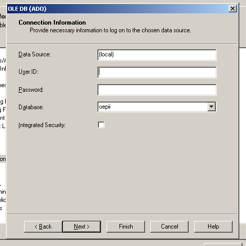

### 5. Adicionar Command/report

O guia usa `Add Command` para integrar o resultado RW ao Crystal. Confirme Book, report, parameters e control flags.

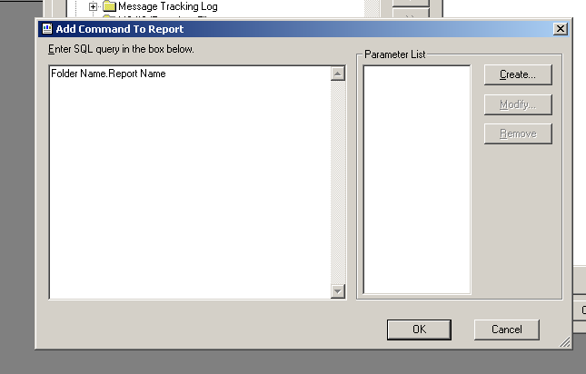

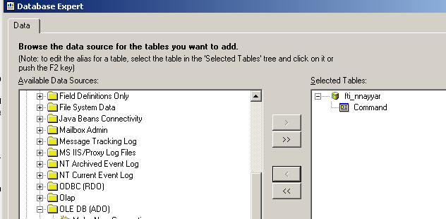

Parameters do Crystal devem corresponder exatamente aos do RW. Nome ou tipo divergente pode gerar prompt duplicado ou execução incorreta.

## Construir e validar o layout

Arraste campos para as seções e configure grupos, fórmulas, totals e formatação.

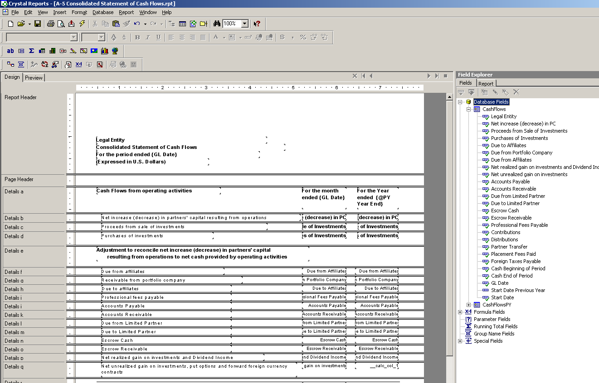

### Preview

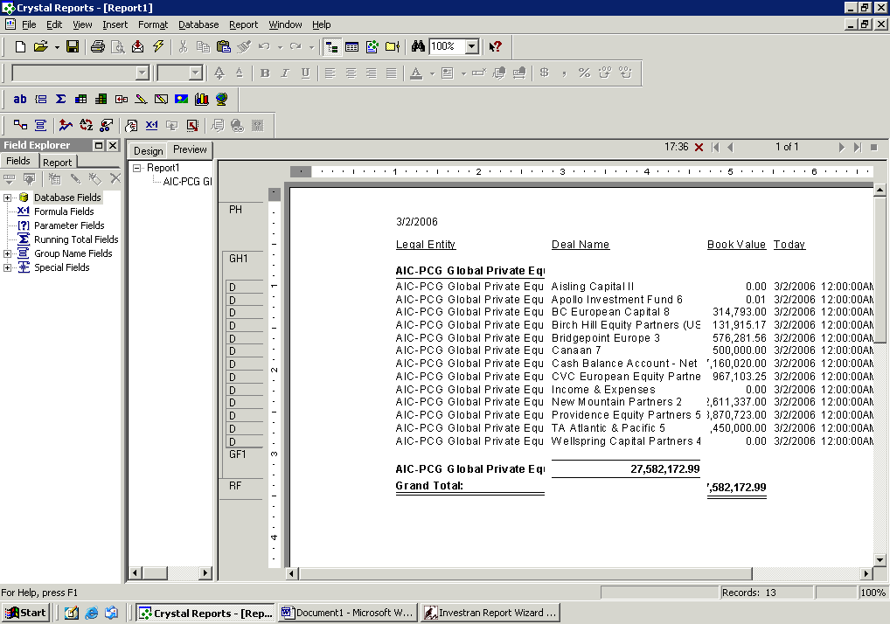

Valide cabeçalhos, rodapés, páginas, grupos, subtotais, escalas, datas, moedas, suppressions, headings e volume representativo.

### Fórmulas

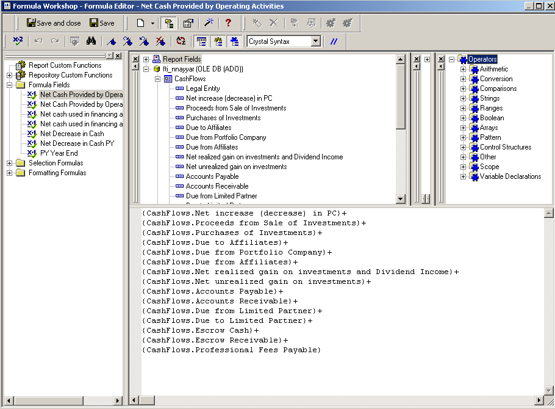

Teste negativos, zero, `Null`, arredondamento e tipos. Não esconda no layout uma correção que deveria ocorrer no RW.

### Exportação

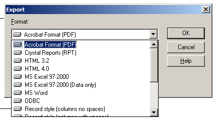

Teste cada formato exigido. PDF, Excel e CSV tratam fontes, grids, datas, células e paginação de maneira diferente.

## Múltiplos reports e subreports

Crystal pode combinar múltiplos reports RW.

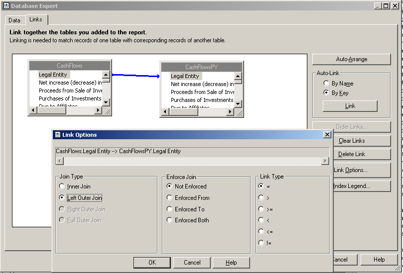

Confirme unicidade, chave funcional, join, row counts e ausência de duplicação/perda.

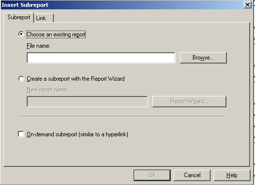

Subreports podem executar uma consulta para cada linha do relatório principal. Avalie impacto de performance.

## Alterar um RW usado pelo Crystal

Quando o driver RW muda, use `Database > Verify Database`.

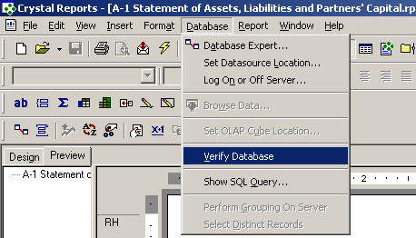

Se campos mudaram, Crystal pode solicitar mapeamento.

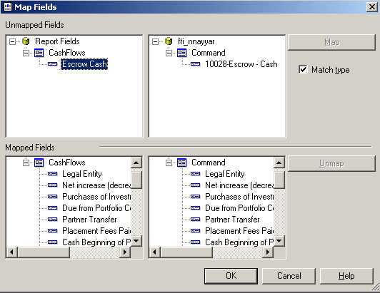

Depois da mudança:

1. execute o RW isoladamente;
2. confirme columns, tipos e ordem;
3. execute Verify Database;
4. mapeie somente campos equivalentes;
5. revise formulas, groups, suppressions e links;
6. execute Preview e exportação;
7. teste no consumidor final.

Não mapeie por semelhança de nome; confirme semântica, tipo, granularidade e unidade.

## Execução programática

### INVDEV Library

Fluxo conceitual:

1. `Login` testa conexão;
2. `Connection` estabelece sessão e metadata;
3. `Metadata` localiza Books/reports;
4. `Report` carrega definição, parameters e columns;
5. aplicação atribui valores e executa;
6. consome o resultset;
7. libera metadata e objetos.

### RWReport wrapper

`RWReport` simplifica localizar Book/report, atribuir `Parameter(name)`, executar `Run`, consultar `Rows`/`Cols` e ler `Cell`, `ColIndex`, `ColType` e `ColTotal`.

Não compartilhe objetos Report Wizard entre threads. Use uma instância por execução/thread conforme o manual.

## Performance

Investigue nesta ordem:

1. escopo e parameters;
2. filters aplicados cedo;
3. granularidade;
4. columns desnecessárias;
5. multiplicação por joins;
6. calculated fields/time periods;
7. múltiplos reports/subreports;
8. formatação/exportação;
9. infraestrutura/database.

Riscos: report sem filtro obrigatório, lookup text desnecessário, subreport repetitivo, layout agrupando volume excessivo e cardinalidade que cresce após uma column.

## Publicação e rollback

Um release pode incluir definição RW, parameters/metadata, `.rpt`, WRS, conexão/provider, consumidores, permissões e baseline.

Antes de promover:

- preserve versões anteriores;
- inventarie consumidores;
- valide IDs/nomes no destino;
- teste conexão sem expor credenciais;
- execute RW isoladamente;
- teste Crystal/WRS/ATM/ARM aplicável;
- valide exportações;
- defina rollback do conjunto completo.

## Troubleshooting por sintoma

| Sintoma | Primeira verificação |
|---|---|
| nenhuma linha | parameters, filters, dados e segurança |
| duplicidade | granularidade e joins |
| total incorreto | cardinalidade, aggregation e formulas |
| parameter não chega | nome e tipo em RW/consumidor |
| funciona no RW, falha no Crystal | provider, command, parameters e Verify Database |
| campo desapareceu | mudança do driver e Map Fields |
| funciona local, falha no WRS | publicação, identidade, segurança e formato |
| diverge no ATM/ARM | contexto, cache, ID/text e ordem das columns |
| demora muito | escopo, joins, volume, subreports e infraestrutura |
| PDF/Excel incorreto | regras do formato e layout Crystal |

## Checklist rápido

- [ ] contrato e granularidade definidos;
- [ ] Book, nome e segurança confirmados;
- [ ] columns adicionadas gradualmente;
- [ ] parameters, filters e time periods testados;
- [ ] row count, totals e amostra reconciliados;
- [ ] consumidores inventariados;
- [ ] Verify Database executado, se aplicável;
- [ ] Preview e exportações testados;
- [ ] performance validada com volume realista;
- [ ] rollback preservado;
- [ ] teste no consumidor final concluído.

## Fontes

- *Internal_Inv7_INV_RW_Dev_Guide_7.pdf* - INVDEV, Report, Column, ParameterSet, TimePeriod, `RWReport` e execução programática.
- *Crystal Reports Guidebook.pdf* - integração RW/Crystal, OLE DB, parameters, layout, links, subreports, Verify Database e exportação.
