# Web Reporting Services - guia prático de administração e integração

Este guia apresenta o **Investran Web Reporting Services (WRS)**: arquitetura, instalação, configuração, segurança, publicação de reports e consumo da API SOAP.

> Neste contexto, Reporting Services significa Investran WRS, não Microsoft SQL Server Reporting Services (SSRS). As telas pertencem ao Investran 7 documentado em 2014; valide versão, TLS, IIS e procedimentos no ambiente atual.

Se o ambiente também utiliza a plataforma Microsoft, consulte [Microsoft SQL Server Reporting Services](04-microsoft-ssrs.md) para entender diferenças, coexistência e padrões possíveis de integração com Investran.

## O que o WRS faz

WRS expõe reports do Report Wizard para Data Exchange e aplicações customizadas. O consumidor descobre reports publicados, obtém parameters e solicita o resultado em XML, HTML ou PDF.

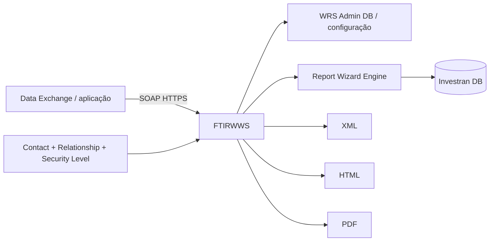

WRS não cria reports. O report é desenvolvido no Report Wizard e publicado para WRS com filtros e security levels.

## Componentes

| Componente | Responsabilidade |
|---|---|
| IIS | hospedar endpoint e componentes web |
| `FTIRWWS` | interface SOAP de execução |
| WRS Configuration Tool | manter empresas/conexões Investran |
| WRS Configuration Editor | configurar URL, porta, protocolo e Data Exchange |
| WRS Admin database | armazenar configuração administrativa |
| Investran database | dados, reports, Contacts e segurança |
| Report Wizard | desenvolver e publicar reports |
| Data Exchange | cadastrar usuários e consumir reports |

## Fluxo de instalação

O manual descreve esta ordem:

1. preparar IIS;
2. configurar Investran;
3. criar WRS Admin database;
4. preparar usuário de serviço/database;
5. instalar componentes;
6. configurar conexões;
7. configurar Data Exchange;
8. cadastrar Contacts, Relationships e security levels;
9. publicar e testar report.

Não execute instalação diretamente em produção sem backup, change aprovado e plano de rollback.

## Preparar IIS

O guia antigo exige ASP e extensões ISAPI. Essas configurações têm impacto de segurança e precisam ser validadas contra a política atual.

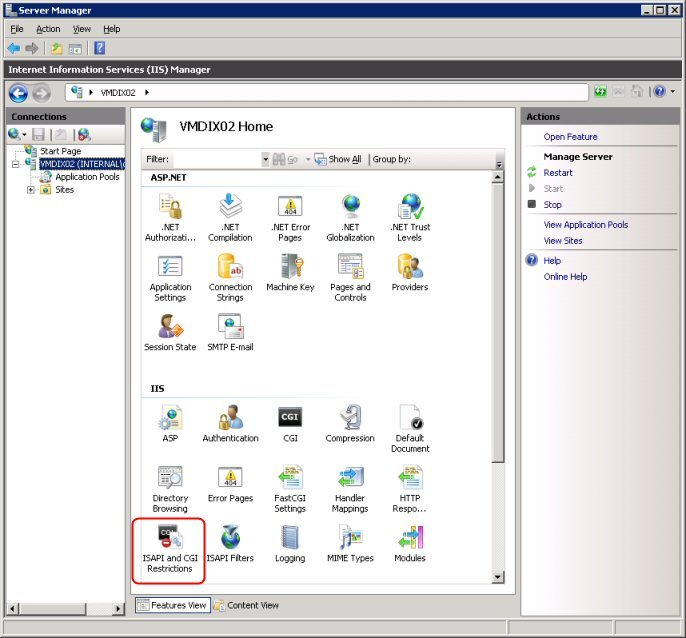

*Área do IIS usada para habilitar recursos ASP/ISAPI. Fonte: WRS Installation and Administration Guide, p. 3.*

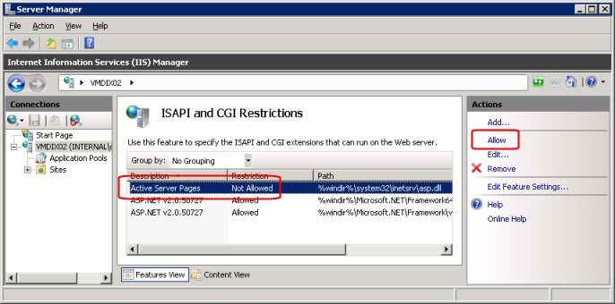

*Restrições ISAPI/CGI no IIS. Fonte: guia WRS, p. 4.*

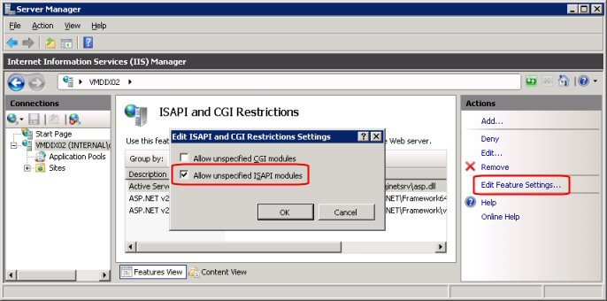

*Configuração histórica Allow unspecified ISAPI modules. Não habilite sem aprovação de segurança. Fonte: guia WRS, p. 4.*

Checklist moderno:

- Windows/IIS suportado pela versão instalada;
- application pool e bitness corretos;
- identidade e permissões mínimas;
- HTTPS e certificado válido;
- protocolos/ciphers aprovados;
- firewall e bindings;
- autenticação coerente;
- logs IIS habilitados;
- health check do endpoint.

## Configurar Investran e licença

O manual cita `UseERW=1` em `Inv_SysConfiguration` e configuração de licenças/funcionalidades. Não altere tabela diretamente sem procedimento aprovado.

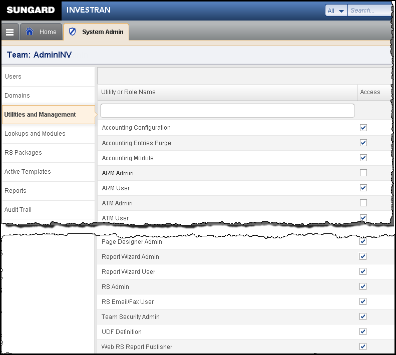

*Tela histórica de administração/licenciamento relacionada ao WRS. Fonte: guia WRS, p. 6.*

Confirme também:

- database é Master correto;
- reports RW existem;
- Contact e security features estão disponíveis;
- conta de serviço possui acesso mínimo necessário;
- backup do WRS Admin DB e configuração existe.

## Instalar componentes WRS

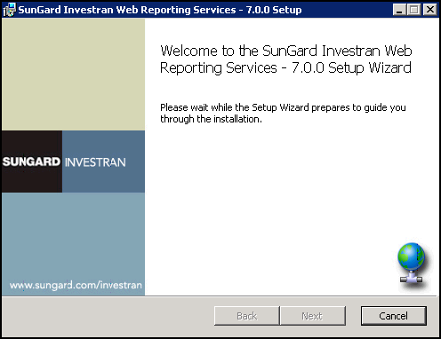

*Início do instalador WRS. Fonte: guia WRS, p. 7.*

O instalador solicita website/virtual directory e pasta de destino.

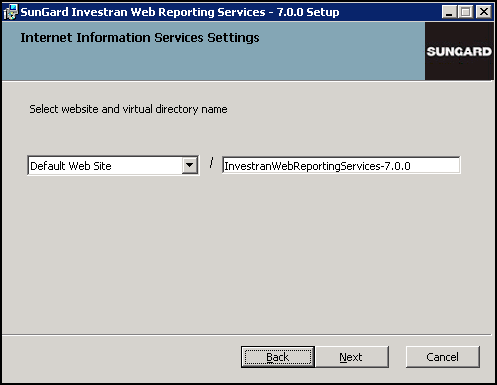

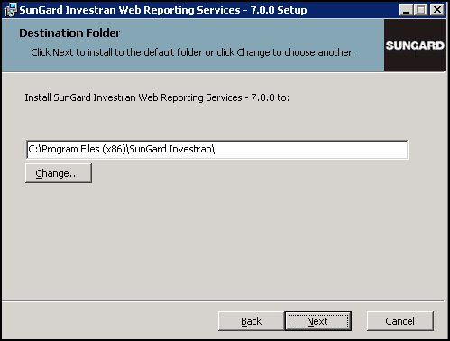

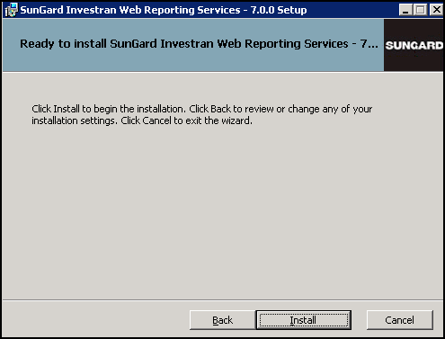

Registre no runbook:

- versão e pacote;
- servidor e website;
- virtual directory/path;
- application pool;
- pasta física;
- arquivos de configuração;
- serviços/contas;
- certificados;
- pré-requisitos;
- log do instalador;
- rollback.

## Configurar empresas e conexões

O WRS Configuration Tool mantém as conexões com databases Investran.

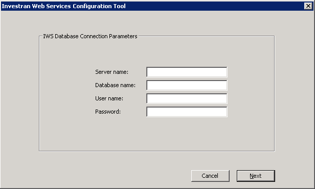

Cadastre Company Name, server, database e credenciais conforme o cofre/política. Use `Test Connection`, salve e depois reabra para confirmar persistência.

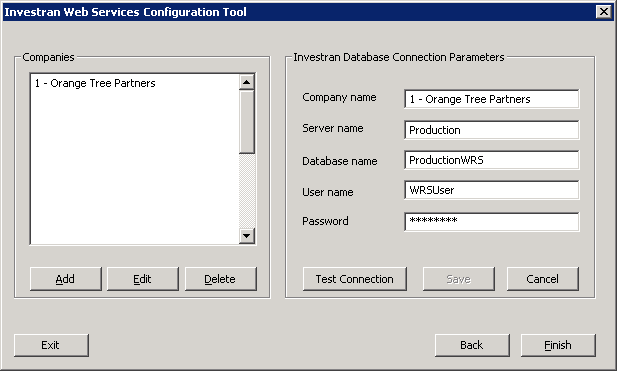

Nunca documente senhas. Registre apenas owner da credencial, cofre, rotação, permissões e procedimento de recuperação.

## Configurar Data Exchange

No Data Exchange, a área WRS Configuration abre o editor de configuração.

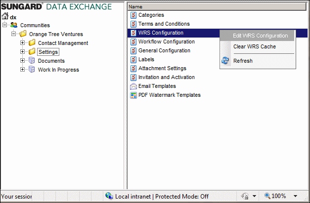

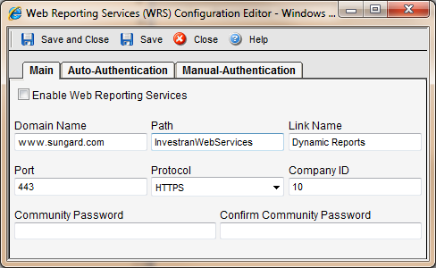

Valores relevantes:

- Enable Web Reporting Services;
- Domain Name;
- Path;
- Link Name;
- Port;
- Protocol HTTP/HTTPS;
- Company ID;
- autenticação configurada.

O manual exige hostname compatível com o certificado para SSL e não aceita IP no Domain Name nesse fluxo. Prefira HTTPS.

## Modelo de segurança

O acesso efetivo depende da combinação:

```text
Contact habilitado para Web Services
+ Relationship com Legal Entity / Investor / Specific Investor
+ Security Level atribuído ao relacionamento
+ Security Level atribuído ao report
+ Report Filter compatível
= report visível e dados filtrados
```

### Criar Security Levels

No Investran Web, a área Investran Web Reporting Services mantém os security levels.

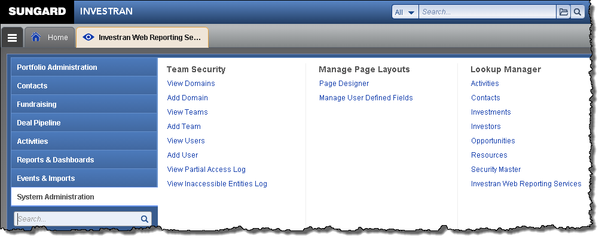

Use nomes que representem audiência/finalidade. Documente quais reports cada nível libera.

### Habilitar Contact

Marque `Web Services Enabled` no Contact autorizado.

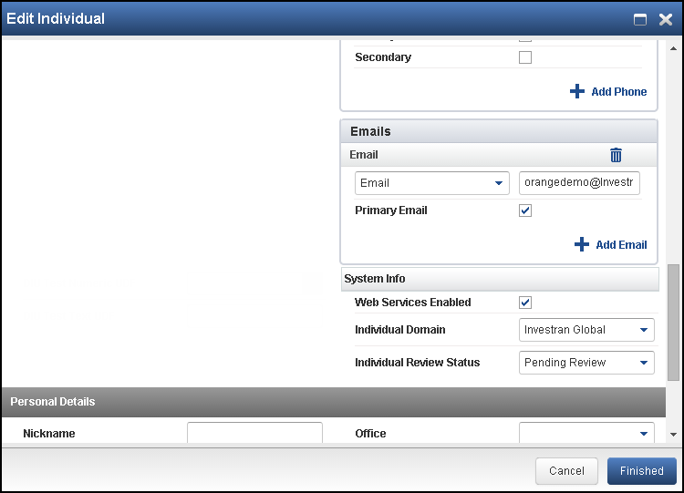

Habilitar o Contact sozinho não concede acesso suficiente: relationships e security levels também são necessários.

### Definir Relationships e Roles

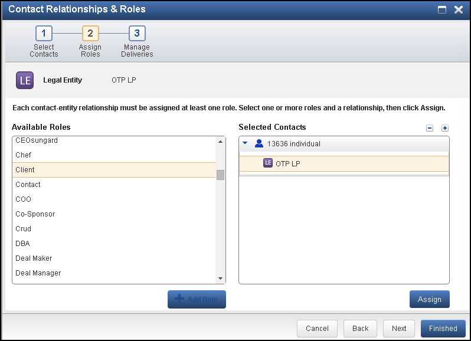

O relacionamento define o contexto de entidades ao qual o Contact pertence. Depois, associe os security levels apropriados.

### Criar usuário no Data Exchange

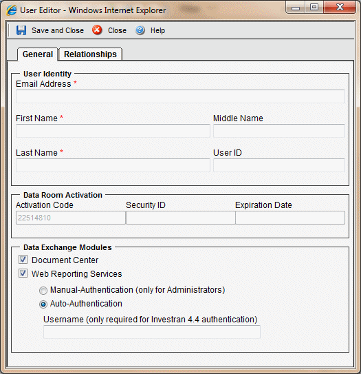

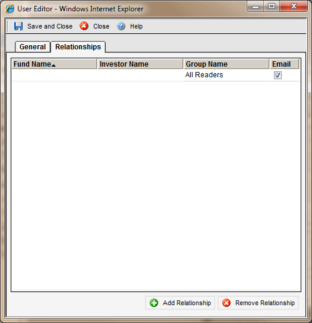

Registre convite/ativação, email, roles, relationships, expiração e processo de revogação. Teste com usuário representativo e privilégio mínimo.

## Publicar um report no WRS

No Report Wizard, abra as configurações WRS do report.

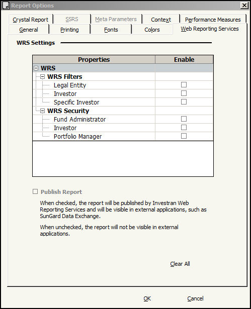

Configure:

1. Report Filter: Legal Entity, Investor, Specific Investor ou All;
2. Security Levels permitidos;
3. `Publish Report`;
4. formatos aplicáveis;
5. parâmetros e Crystal associado, quando existir.

Depois de publicar, o report aparece identificado como Published.

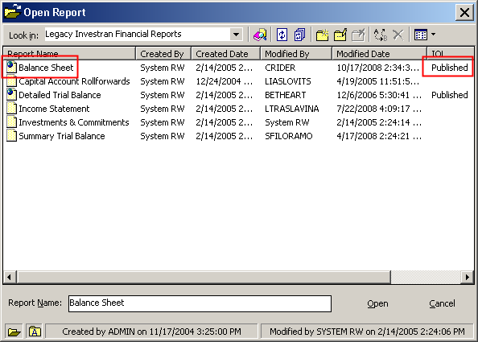

Teste com Contacts de perfis diferentes. Uma conta administrativa não demonstra que o filtro por relacionamento funciona.

## Entender Report Filter

Report Filter controla como o contexto do Contact restringe a saída. A matriz do manual combina Contact Relationship, Report Filter e Report Output Level.

Princípios:

- Legal Entity: saída no contexto das Legal Entities relacionadas;
- Investor: saída no nível de Investor relacionado;
- Specific Investor: escopo mais específico;
- All: requer atenção especial porque pode ampliar a visibilidade;
- combinações incompatíveis podem impedir seleção ou execução.

Antes de publicar, documente exemplos de “deve ver” e “não deve ver”.

## Consumir a API SOAP

O endpoint histórico usa `FTIRWWS.dll?Handler=Default`. Confirme URL real, HTTPS, autenticação e versão no ambiente.

Sequência recomendada:

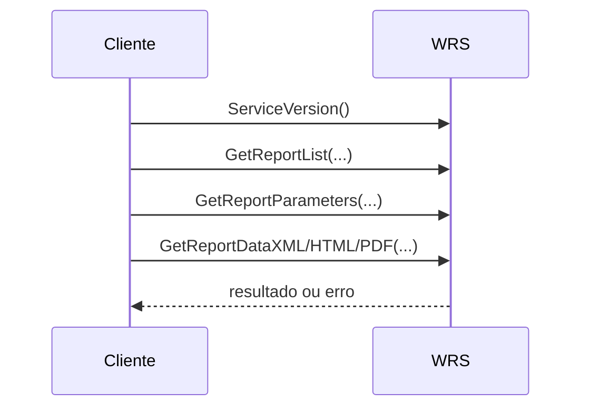

### Métodos principais

| Método | Finalidade |
|---|---|
| `ServiceVersion` | obter versão do serviço |
| `GetReportList` | listar Books/reports disponíveis e formatos |
| `GetReportParameters` | obter parameters exigidos |
| `GetReportDataXML` | executar e retornar XML |
| `GetReportDataHTML` | executar e retornar HTML |
| `GetReportDataHTMLLocalizedDate` | HTML com formato de data selecionado |
| `GetReportDataHTMLFirstPage` | iniciar HTML paginado e obter Process ID |
| métodos de páginas subsequentes | recuperar outras páginas pelo Process ID |
| `GetReportDataPDF` | executar e retornar PDF |

Use o nome/ID retornado pelo serviço. Não suponha que Book, report ou parameter permaneceu igual entre ambientes.

## Identidades de execução

O guia diferencia:

- credenciais SQL associadas ao acesso técnico;
- email de Investran Contact habilitado para WRS.

Com Contact, security levels, relationships e filters podem ser aplicados. Com identidade técnica, o comportamento de segurança pode ser diferente. Não substitua uma identidade pela outra sem analisar impacto de autorização.

Nunca registre passwords em logs, exemplos, tickets ou repositório.

## Formatos de saída

### XML

Adequado para integração estruturada. Valide encoding, `colname`, `coltype`, `Null`, datas, lookup text/ID e volume.

### HTML

Pode retornar body e informações separadas de header/page header/page footer. Teste paths de imagens, CSS, encoding e paginação.

### PDF

Adequado para documento final. Valide fonts, imagens, orientação, tamanho, paginação e memória do servidor.

Use `GetReportList` para confirmar quais formatos o report realmente oferece.

## Logs e monitoramento

Correlacione:

- timestamp e timezone;
- endpoint/Company ID;
- Contact ou identidade técnica, sem segredo;
- Book/report;
- parameters sanitizados;
- formato;
- duração;
- tamanho/linhas/páginas;
- HTTP/SOAP error;
- IIS request ID e Process ID, quando houver.

Monitore disponibilidade, latência, taxa de erro, volume, fila/concorrrência, consumo de memória, certificados, application pool e conexões com databases.

## Troubleshooting

### Endpoint indisponível

1. DNS, porta e firewall;
2. certificado e binding HTTPS;
3. website/application pool;
4. virtual directory/path;
5. módulos/handlers;
6. logs IIS e Event Viewer.

### `ServiceVersion` funciona, report falha

1. Company ID/conexão;
2. database e conta;
3. Book/report publicado;
4. parameters;
5. Contact/security/filter;
6. Report Wizard isolado;
7. Crystal associado, se aplicável.

### Report não aparece

Confirme `Publish Report`, security level do report, Contact habilitado, relationship, security level da relationship e Report Filter.

### Usuário vê dados demais

Trate como incidente de segurança. Suspenda acesso/publicação conforme procedimento e revise imediatamente Contact, relationships, security levels e Report Filter.

### XML funciona, PDF/HTML falha

Investigue Crystal/layout, imagens, fonts, paths, permissões, memória e formato habilitado.

### Timeout ou lentidão

Execute o RW isoladamente, restrinja parameters, verifique volume, Crystal/subreports, concorrência, database e application pool.

## Mudança e rollback

Uma mudança WRS pode envolver IIS, certificado, configuração, Company connection, database, Contact/security, report RW e Crystal.

Antes do deploy:

- exporte configurações aprovadas;
- preserve arquivos e databases;
- registre bindings/certificados;
- teste em ambiente inferior;
- defina smoke tests;
- determine owner e janela;
- planeje rollback de todas as camadas.

Smoke test mínimo:

1. `ServiceVersion`;
2. listar reports;
3. obter parameters;
4. executar report pequeno em XML;
5. executar HTML/PDF aplicável;
6. testar Contact autorizado;
7. testar Contact não autorizado;
8. verificar logs e latência.

## Checklist rápido

- [ ] endpoint, certificado e IIS saudáveis;
- [ ] Company ID e conexão validados;
- [ ] conta e rotação documentadas sem senha;
- [ ] Contact habilitado;
- [ ] relationships/security levels corretos;
- [ ] report publicado com filtro adequado;
- [ ] parameters obtidos dinamicamente;
- [ ] XML/HTML/PDF testados conforme uso;
- [ ] segurança positiva e negativa validada;
- [ ] logs e correlação disponíveis;
- [ ] backup e rollback definidos.

## Fontes

- *Internal_Inv7_INV_WRS_Install-Admin_7.pdf* - instalação, configuração, usuários, segurança, publicação e output matrix.
- *Internal_Inv7_InWRS_API_Guide.pdf* - endpoint SOAP, métodos, parameters e formatos.
